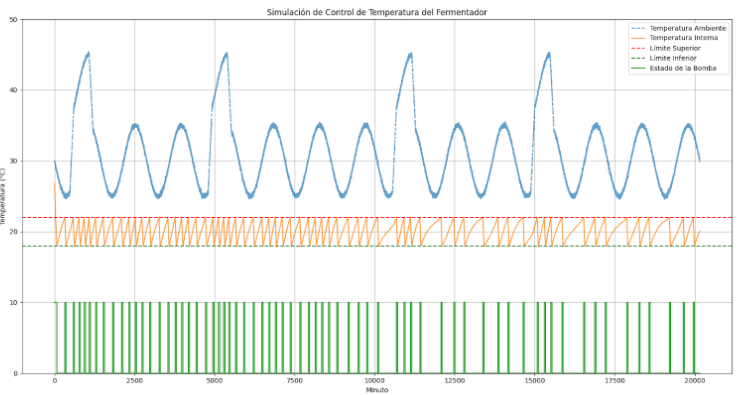

<!-- @format -->

# Simulación de Control de Temperatura del fermentador de cerveza

Codigo correspondiente a la simulacion de funcionamiento del sitema de control de un fermentador para el Trabajo Practico de Teoria de Control.

Alumnos: Losada y Cabaleiro. K4011 1C2024 UTN FRBA.

## Requisitos

### 1. Descargar el Repositorio con el script y el archivo CSV con los datos de las temperaturas

1.1 Descargar [Git](https://git-scm.com).

1.2 Correr los siguientes comandos:

```sh
git clone https://github.com/ucabaleiro/tp-tdc
cd tp-tdc
```

### 2. Descripcion del contenido de la carpeta y su funcionamiento

#### El script sim.py realiza las siguientes acciones:

1. Lee el archivo ambient_temperature.csv que contiene datos de temperatura ambiente.
2. Inicializa las condiciones y parámetros para la simulación de control de temperatura.
3. Ejecuta una simulación en la que se controla una bomba de calor para mantener la temperatura interna dentro de un rango deseado.
4. Genera un gráfico que muestra la evolución de la temperatura interna en comparación con la temperatura ambiente.

### 3. Instalar Python 3

Como el script utiliza [Python 3](https://www.python.org/downloads/) hay que tenerlo instalado y corriendo en la maquinaen la que se quiera correr el script.
Por esa razon, se necesitan tener instaladas las siguientes dependencias antes de ejecutar el script:

- numpy
- pandas
- matplotlib

Puede instalar estas dependencias utilizando `pip`:

```sh
pip install numpy pandas matplotlib
```

### 4. Correr el script con la simulacion

La simulacion a ejecutar tiene como rango de error de temperaturas con los parametros: limite inferior 18 °C y limite superior 22 °C

```sh
python ./sim.py
```

### 4. Resultado esperado de la simulacion

El resultado en este caso fué el esperado: la temperatura se mantuvo entre los límites especificados pero esta vez la bomba pasó por menos ciclos de encendido y apagado. Cabe aclarar que se observa como la temperatura de la cerveza (Linea color Naranja) parte de un estado inestable hasta llegar al estado estable.


